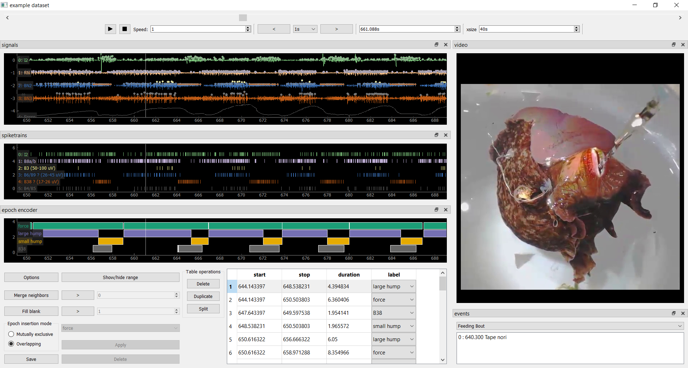

Jeff's Data Analysis Toolchain
==============================

Installing dependencies
-----------------------

You will need access to these commands on the command line:

- ``conda`` (Anaconda_ or Miniconda_ with Python 3)
- ``git`` (git-scm.com_)

Download this source code, either manually through GitHub_ or using ``git``::

    git clone https://github.com/jpgill86/analysis.git

On the command line, navigate to the top-level directory::

    cd analysis

Create a new conda environment::

    conda env create -f environment.yml -n <envname>
    conda activate <envname>
    pip install -r requirements.txt

where ``<envname>`` can be anything you like, or update an existing one::

    conda env update -f environment.yml -n <envname>
    conda activate <envname>
    pip install -U -r requirements.txt

You may use ``snapshots/environment-XXXX-XX-XX.yml`` instead to create an exact
replica of an environment created from ``environment.yml`` from a particular
date (these files were created using ``conda env export``, with git commands
pointing to specific commits added manually). This is useful for tracking down
bugs or reproducing old results exactly when external package updates create
unexpected changes in output. Using old environment snapshots may result in
installing old versions of packages when newer versions would work just as well,
so try ``environment.yml`` first.

.. _Anaconda:       https://www.anaconda.com/download/
.. _Miniconda:      https://docs.conda.io/en/latest/miniconda.html
.. _git-scm.com:    https://git-scm.com/downloads
.. _GitHub:         https://github.com/jpgill86/analysis/

Getting started
---------------

Activate your conda environment and launch Jupyter notebook::

    conda activate <envname>
    jupyter notebook

Using the Jupyter file browser, navigate to a Jupyter notebook file
(``*.ipynb``) and click on it to begin a session.

Running the ephyviewer example
------------------------------

Launch the ``Data Explorer.ipynb`` notebook located in the ``example``
directory. Run all cells in order. A Qt-based graphical user interface will
launch. (Note that this type of GUI cannot be launched from a Jupyter server
running on a remote computer, such as with MyBinder.org.)

The ephyviewer interface is interactive and highly customizable.

- Pressing the play button will scroll through the data and video in real time,
  or at higher or lower rate if the speed parameter is changed.
- Right-clicking and dragging right or left will contract or expand time to show
  more or less at once.
- Scrolling the mouse wheel in the trace viewer or the video viewer will zoom.
- The epoch encoder can be used to block out periods of time during which
  something interesting is happening for later review or further analysis.
- All panels are optional and can be hidden, undocked, or repositioned
  on the fly.

See the `ephyviewer documentation`__ for more details.

__ http://ephyviewer.readthedocs.io

Notes
-----

As of 2018-11-29, with ipykernel>=5.0.0 (versions 5.0.0 and 5.1.0 tested), there
is a compatibility issue with tridesclous in which the kernel sometimes fails to
recognize that a GUI window has been closed and becomes unresponsive. To work
around this, ipykernel is pinned to an older version in ``environment.yml``.

As of 2019-03-27, conda>=4.6.3 has an issue_ in Windows that causes instructions
for pip located in `environment.yml` to be ignored. I added to the installation
instructions explicit `pip install` commands to work around this. This is likely
not an issue in Mac or Linux, so `conda env create` should be enough, and the
issue will hopefully be fixed for Windows in conda>=4.6.9.

.. _issue: https://github.com/conda/conda/issues/8404
